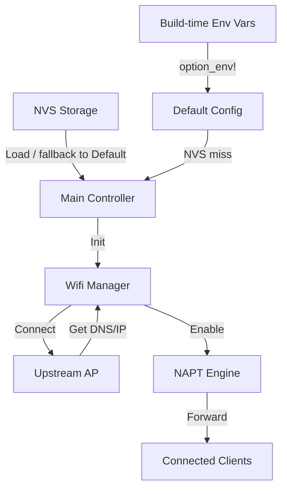

# システム設計概要

## システム構造
各コンポーネントの責務を以下に定義する

| コンポーネント | 責務 | 該当ファイル |
| :--- | :--- | :--- |
| メイン制御 | 初期化、CLIループ、ライフサイクル管理 | `main.rs` |
| WiFi管理 | STA/APスタック制御、接続フロー、静的IP適用、PM設定 | `wifi/mod.rs` |
| ネットワーク設定 | NAPT有効化、MTU/MSS clamp、DNS配布 | `wifi/netif.rs` |
| 設定管理 | NVSへのJSON永続化、シリアライズ、デフォルト値 | `config.rs` |
| CLI | シリアル入力読み取り、コマンド解析・実行 | `cli/commands.rs`, `cli/input.rs` |

## データフロー

## 設計上の決定事項
- **メモリ安全性**: Rustの所有権モデルにより、組み込み環境特有のメモリリークや競合を排除
- **設定フォーマット**: 汎用性とデバッグ性を考慮し、NVS内データはJSON形式を採用
- **同期実行**: 起動シーケンスの確実性を担保するため、`BlockingWifi` による同期的接続処理を実施
- **省電力設計**: WiFiモデムスリープ (`WIFI_PS_MIN_MODEM`) + CPU動的周波数スケーリング (40〜80MHz) + FreeRTOSティックレスアイドルによるライトスリープを組み合わせる。`WIFI_PS_NONE` は最低遅延だがライトスリープ不可のため不採用。PM設定 (`esp_pm_configure`) はWiFi接続確立後に適用する
